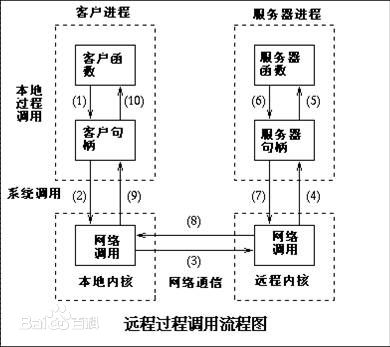

## what's the RPC?

####RPC（Remote Procedure CallProtocol）——远程过程调用协议，它是一种通过网络从远程计算机程序上请求服务，而不需要了解底层网络技术的协议。

#### 简单来说rpc就是client在不知道任何底层实现的情况下，可以直接调用server的函数方法；而server也可以直接调用client的函数。

#### 百度给出的流程图：

## 